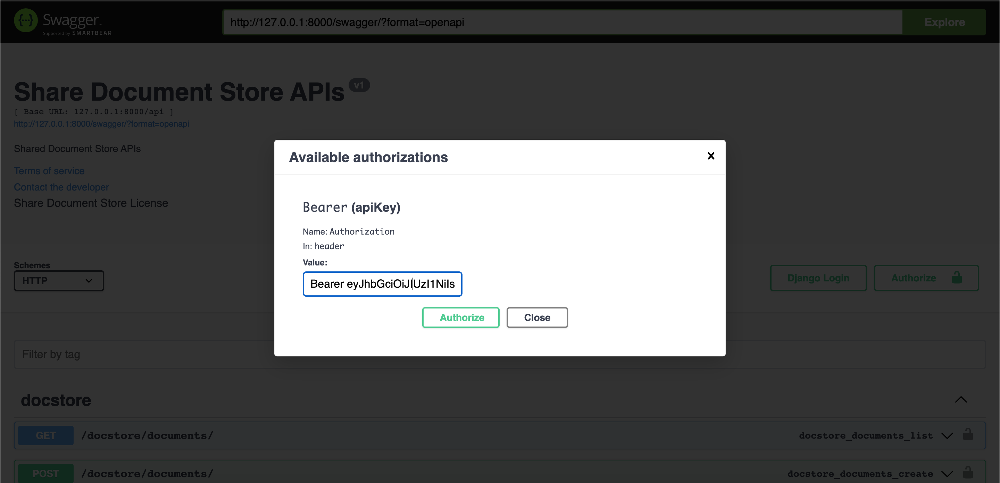

# Shared Document Store (SDS)

Shared Document Store (SDS) is a quick prototype of a RESTful API service for managing and organizing documents. It
provides functionalities for creating, updating, retrieving, and deleting documents, folders, and topics. The SDS system
is built using Python 3.9, Django, and PostgreSQL.

## Task Overview

The task is to develop a prototype for the SDS system with the following key aspects:

- Use Python 3.9, Django, and PostgreSQL.
- Design a basic document storage system with tables for "Documents," "Folders," and "Topics." Consider implementing
  nested folders.
- Communicate the design with enough detail so that another developer can effectively implement it using the provided
  documentation.
- Build the RESTful API service to perform operations on the resources.
- Implement test cases to ensure the functionality and reliability of the SDS system.

## Getting Started

### Prerequisites

To run the SDS system locally, you need to have the following installed:

- Python 3.9 or higher
- Django
- PostgreSQL

### Installation Using Docker Compose

To run the SDS system using Docker Compose, follow these steps:

1. Install Docker and Docker Compose on your system.
2. Clone the repository:

```shell
git clone https://github.com/Shrhawk/Shared-Document-Store-Assignment.git
```

3. Navigate to the project directory:

```shell
cd Shared-Document-Store-Assignment
```

4. Build and run the Docker containers:

```shell
docker-compose up --force-recreate
```

5. Access the SDS API at http://localhost:8000/.
6. Access the SDS Swagger Docs at http://localhost:8000/swagger/.
7. Access the SDS Redoc Docs at http://localhost:8000/redoc/.

### Manual Installation

1. Clone the repository:

```shell
git clone https://github.com/Shrhawk/Shared-Document-Store-Assignment.git
```

2. Create a virtual environment:

```shell
cd Shared-Document-Store-Assignment
python3 -m venv venv
```

3. Activate the virtual environment:

- For Linux/Mac:

  ```shell
  source venv/bin/activate
  ```

- For Windows (PowerShell):

  ```shell
  .\venv\Scripts\activate
  ```

4. Install the dependencies:

```shell
pip install -r requirements.txt
```

5. Set up the PostgreSQL database:

- Create a new PostgreSQL database for the SDS system.
- Rename `sample.env` to `.env` and update this file with your database credentials.

6. Apply the database migrations:

```shell
python manage.py migrate
```

7. to download static files for swagger and admin panel:

```shell
python manage.py collectstatic
```

8. Create Super User to access admin panel:

```shell
python manage.py createsuperuser
```

## Usage

1. Start the development server:

```shell
python manage.py runserver
```

2. Access the SDS API at http://localhost:8000/.
3. Access the SDS Swagger Docs at http://localhost:8000/swagger/.

- Use postman to upload file. Swagger didn't support it properly. You can find
  the [postman](DocStore.postman_collection.json)
- In Swagger don't forget to add "Bearer {token}" for authenticated routes.
- 

4. Access the SDS Redoc Docs at http://localhost:8000/redoc/.
5. Access the SDS Redoc Docs at http://localhost:8000/admin/.

## Testing

To run the test cases for the SDS system, execute the following command:

1. To run all tests:

```shell
pytest -vv -s
```

2. To run particular file tests

```shell
pytest tests/docstore/test_document.py -vv -s
```

3. To run particular test

```shell
pytest tests/docstore/test_document.py::TestsDocumentListCreateView::test_document_create -vv -s
```

# I hope this meets your requirements! Thank You
